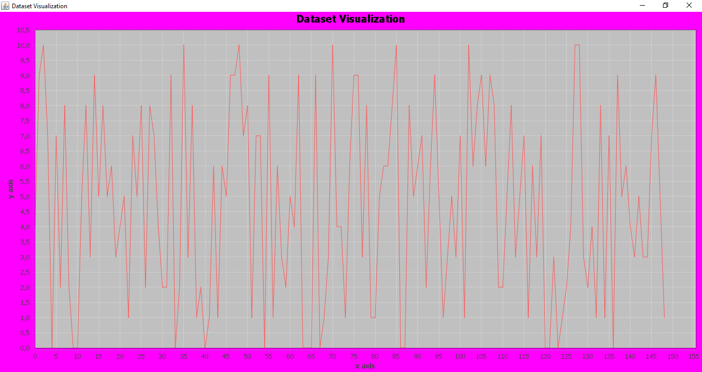
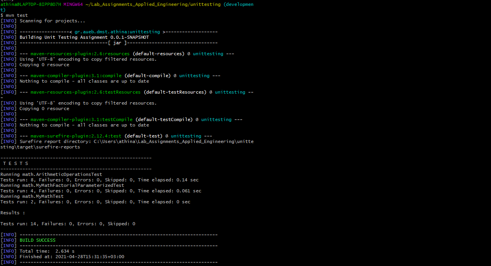

# Lab_Assignments_Applied_Engineering

\
Assignment for 6th semester course "Applied Software Engineering"\
Department of Management Science and Technology\
Athens University of Economics and Business

### Description
1. First Assignment: Create and generate a histogram with a txt dataset.
2. Second Assignment: Test functions with junit. 

## Menu
- [Getting Started](#getting-started)
    - [Prerequisites](#prerequisites)
    - [Installing](#installing)
- [Demo](#demo)
- [Authors](#authors)

## Getting Started
These instructions will give you a copy of the project up and running on
your local machine.

### Prerequisites
Requirements for the project's software and other tools to build it in your machine.
- [Java 8 or newer](https://www.java.com/en/download/manual.jsp)
- [Apache Maven](https://maven.apache.org/download.cgi)

### Installing
A step by step instructions on how to get the jar running.

To install this repo locally run

    git clone https://github.com/AthinaDavari/Lab_Assignments_Applied_Engineering.git

In order to build the modules and install the jar, run the command in repos' root directory
    
    mvn package

and then:
* if you want to generate a histogram:

	enter the gradeshistogram folder, next target folder and run the command
	
	    java -jar gradeshistogram-0.0.1-SNAPSHOT-jar-with-dependencies.jar [FILE]
	
	FILE : the name of the txt file (or the url we can find that file) which contains the dataset for the chart.

* If you want to test the unittesting module:

	run the command in unittesting directory
	    
	    mvn test  

## Demo
* If you install and run the gratehistogram jar successfully, you will see a chart like the following:

  

* If you install and run the unittesting test successfully, you will see a screen like the foolowing picture and a green "BUILD SUCCESS" message at the end:

## Authors
* [Athina Davari](https://github.com/AthinaDavari) 
