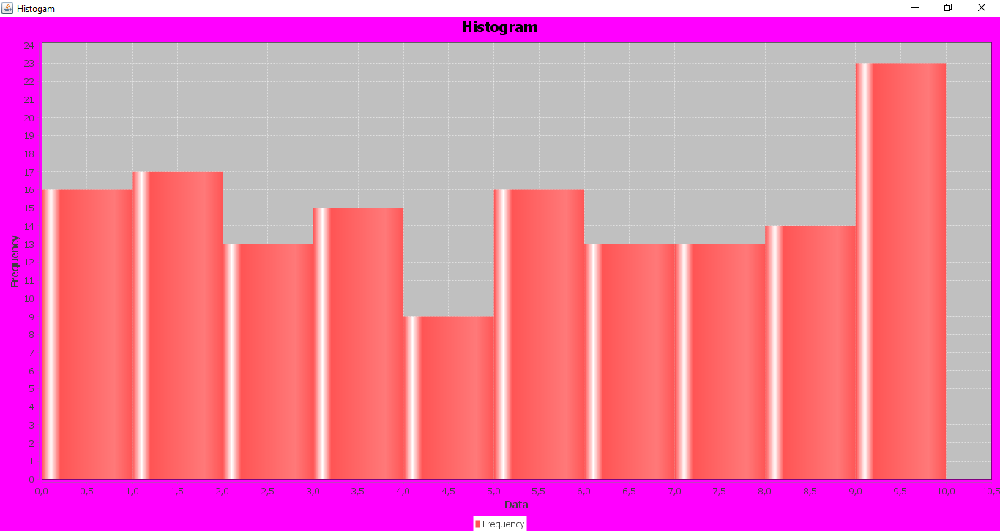

# Gradeshistogram

A project for the first ASE assignment. Create and generate a histogram with a txt dataset.

## Menu
- [Run the module](#run-the-module)
- [Demo](#demo)
- [Authors](#authors)

## Run the module
Step-by-step instructions on how to get the jar running when you have already installed the project on your local machine.

In order to build gradeshistogram module and install the jar, run the command in repos' root directory

    mvn package

and then enter the gradeshistogram folder, next target folder and run the command

    java -jar gradeshistogram-0.0.1-SNAPSHOT-jar-with-dependencies.jar [FILE]

FILE : the name of the txt file (or the url we can find that file) which contains the dataset for the chart.

## Demo
If you install and run the software successfully, you will see a chart like the following:

## Authors
* [Athina Davari](https://github.com/AthinaDavari) 
