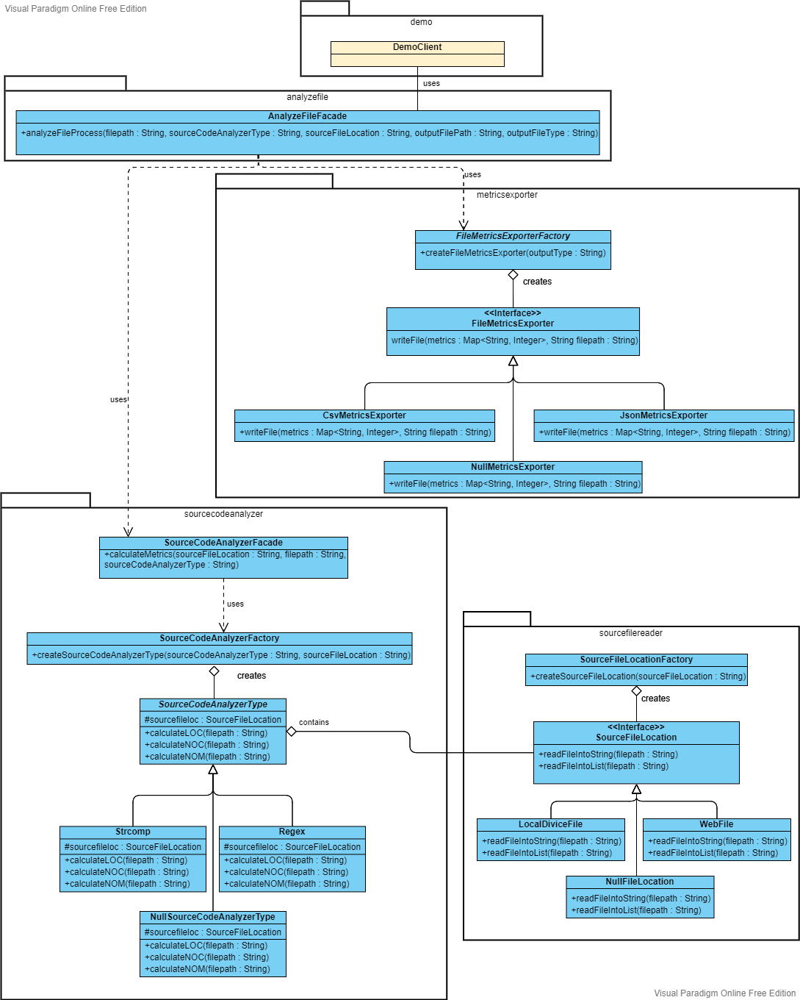

# Sourcecodeanalyzer
A project for the third ASE Design Pattern assignment. It reads a Java source
code file that is stored locally or on the web, calculates the Lines of Code
(LOC), Number of Classes (NOC) and Number of Methods (NOM) metrics,
and finally, exports these metrics to an output file.

## Menu
- [Run the module](#run-the-module)
- [Class Diagram](#class-diagram)
- [Report](#report)
- [Authors](#authors)

## Run the module
Step-by-step instructions on how to get the jar running, run the tests and export JaCoCo report when you have already installed the project on your local machine.

In order to build sourcecodeanalyzer module and install the jar, run the command in sourcecodeanalyzer directory:

    mvn package

then enter the target folder and run the command:

    java -jar sourcecodeanalyzer-0.0.1-SNAPSHOT-jar-with-dependencies.jar [arg0] [arg1] [arg2] [arg3] [arg4]

[arg0] : “JavaSourceCodeInputFile” (e.g., src/test/resources/TestClass.java)\
[arg1] : “sourceCodeAnalyzerType” [regex|strcomp]\
[arg2] : “SourceCodeLocationType” [local|web]\
[arg3] : “OutputFilePath” (e.g., ../output_metrics_file)\
[arg4] : “OutputFileType” [csv|json]

In order to test the sourcecodeanalyzer module, run the command in sourcecodeanalyzer directory:
    
     mvn test
    
If you want to generate JaCoCo Report, run the command in sourcecodeanalyzer directory:
 
     mvn package jacoco:report
     
  and to open the report run:

- For Windows cmd:
      
      target\site\jacoco\index.html
           
- For Git Bash:
   
      start target/site/jacoco/index.html
      
- For Linux terminal:
   
      xdg-open target/site/jacoco/index.html

## Class Diagram

## Report
   
Design Patterns used:
- Strategy
- Factory
- Brigde
- Facade

### MetricsExporters redesign
Design Patterns Used: Factory on Strategy and Null Object\
Package: metricsexporter \
We wanted outputFileType to be extendable.
#### Pros:
- Easier extensibility.
- You are free to choose an algorithm (depents the output file type you want).
- Extend FileMetricsExporter hierarchy without affecting other class code.
- Open/Closed Principle: You can create new types of FileMetricsExporter into the program without breaking existing code.
- You can avoid having to write testing cases which handles the null invalid outputFileType.
#### Cons: 
- Problems with handling Nuul cases on tests.

### SourceCodeAnalyzers redesign
Design Patterns Used: Factory - Facade and Null Object\
Package: sourcecodeanalyzer\
We wanted sourceCodeAnalyzerType to be extendable.
#### Pros:
- You can isolate your code from the complexity of a subsystem.
- Use facade to define an entry point to the calulation of Metrics proccess.
- We can extend SourceCodeAnalyzerType hierarchy without affecting the whole analysis of a file proccess.
- You can avoid having to write testing cases which handles the null invalid sourceCodeAnalyzerType.
#### Cons:
- Problems with handling Nuul cases on tests.

### SourceFileReaders redesign
Design Patterns Used: Factory and Null Object\
Package: sourcefilereader\
We wanted sourceFileLocation to be extendable.
#### Pros:
-  You can avoid having to write testing cases which handles the null invalid sourceFileLocation.
#### Cons:
- Problems with handling Nuul cases on tests

### SourceCodeAnalyzers and SourceFileReaders Connection
Design Patterns Used: Bridge\
Packages: sourcecodeanalyzer, sourcefilereader\
We wanted SourceCodeAnalyzers and SourceFileReaders dimensions to be independent.

#### Pros:
- Open/Closed Principle: You can introduce new abstractions and implementations independently from each other.\
- Single Responsibility Principle: You can focus on high-level logic in the abstraction and on platform details in the implementation.
- SourceCodeAnalyzers and SourceFileReaders dimensions are independent new types of SourceFileLocation(SourceFileReaders) does not affect the SourceCodeAnalyzerType(SourceCodeAnalyzers) hierarchy.

### Code on democlient
Design Patterns Used: Facade\
Package: analyzefile\
We wanted demoCliend class to low coupled to implementations.
#### Pros:
- A simple interface for client, hiding from client the complexity of the anyleze code proccess.
- When you change the proccess, you don't need to change client's code.

## Authors
* [Athina Davari](https://github.com/AthinaDavari) 
